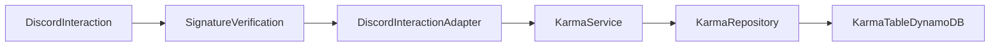

# Architecture

## Flow

## Layering

- `src/domain/*`: business rules (mapping, limits, self-action constraints).
- `src/platforms/*`: platform-specific adapters (Discord now, Slack later).
- `src/persistence/*`: repository abstraction and storage implementations.
- `src/handlers/*`: Lambda entrypoints.

## Data Model

DynamoDB table keyed by `userId`:

- `userId` (PK, string)
- `karmaTotal` (number)
- `karmaMax` (number, highest achieved total)

## Slack Readiness

`KarmaService` receives normalized `KarmaActionEvent` and returns text responses, so a future Slack adapter can:

1. Parse Slack mentions and symbol runs.
2. Map payload into `KarmaActionEvent`.
3. Reuse existing domain and persistence layers unchanged.
